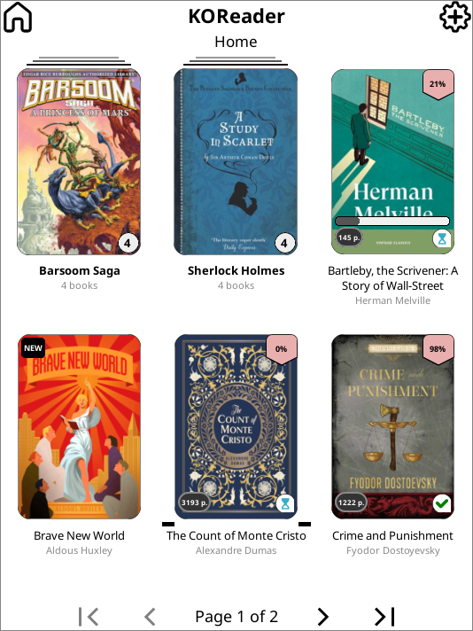
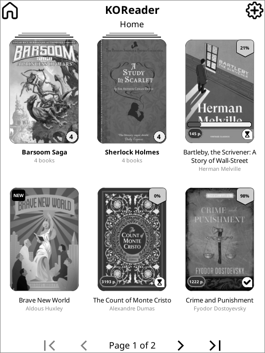
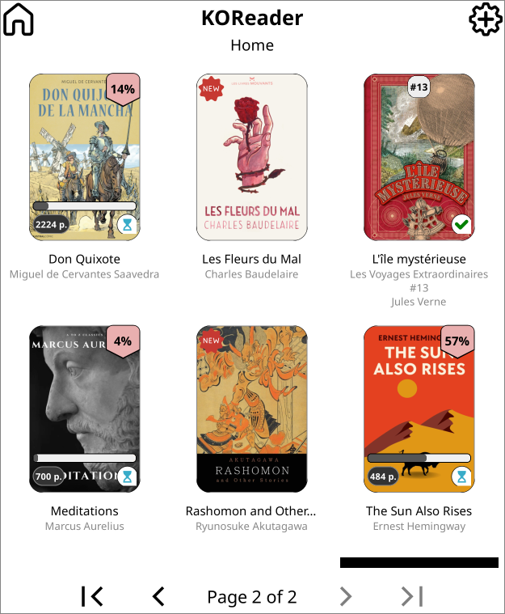
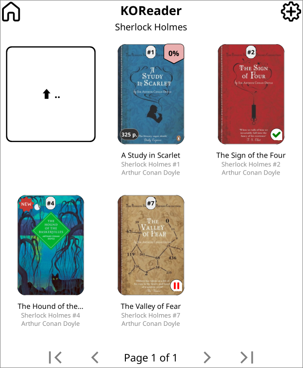
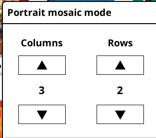
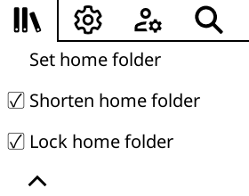

# KOReader Mosaic Patches

A curated set of [KOReader](https://koreader.rocks/) user patches for the default KOReader CoverBrowser plugin mosaic file-browser view. This project consolidates 13+ community patches into 3 unified Lua scripts. 

It is based on the work of several KOReader community contributors with bug fixes, performance improvement, a unified configuration surface, new features and aesthetic adjustments.

  

  

## Patches

### Visual Overhaul (`2--visual-overhaul.lua`)

Consolidated patch that replaces the default mosaic cover appearance. Merges the former standalone patches for stretched covers, rounded corners, folder covers, overlay badges, and automatic series grouping into a single file. Requires `2--disable-all-CB-widgets.lua` to be installed first.

#### Cover rendering

Stretched covers with aspect ratio control . Set `fill = true` to ignore the ratio and fill the entire cell. Rounded corners are drawn via four SVG overlays . A thin border  frames every cover. Results are memoised in an cache (2000 entries) to avoid redundant rebuilds during scrolling.

#### Folder covers

Folders display a cover image sourced from `.cover.{jpg,jpeg,png,webp,gif}` inside the folder. If no `.cover` file exists, the first book with a cached cover is used instead. A capitalized folder name is rendered centered over the cover (toggleable via the settings menu). A file-count badge (rounded pill) appears in the bottom-right corner.

#### Overlay badges

- **Progress bar** -- bottom of cover, inside border. Rounded horizontal bar; fill colour changes to grey for abandoned/paused books. Hidden below 2% and treated as complete above 97%.
- **Percent badge** -- top-right corner. Icon with percentage text (e.g. "42%") overlaid. Shown when a book is in progress.
- **Pages badge** -- bottom-left corner. Page count from metadata or filename pattern `P(123)` displayed as a "123 p." pill. Shown for unread books.
- **Series badge** -- top-middle area. Small rounded rectangle showing "#N" (e.g. "#3"). Shown when `series` and `series_index` metadata are present.
- **"NEW" badge** -- top-left corner. Shown for books added within a configurable number of days (default 30).
- **Status dogear** -- bottom-right corner (Reading, Completed, On-Hold)

  

#### Automatic series grouping

When enabled (toggle: "Group book series into folders" in file browser settings), books sharing the same `series` metadata field (`calibre:series` / `belongs-to-collection`) are collapsed into a virtual folder. Tapping a series folder opens a sub-view sorted by `series_index`. Series metadata is extracted in the background. If every book in a directory belongs to the same series, grouping is skipped. Single-book series are unwrapped back to regular entries.

  

### Disable CoverBrowser Widgets (`2--disable-all-CB-widgets.lua`)

Prerequisite patch. Suppresses the stock CoverBrowser overlay widgets (progress bar, collection star, description hint) so the visual overhaul can draw its own replacements without conflicts.

### Double-Tap to Open (`2-browser-double-tap.lua`)

Requires a double-tap to open books in the file browser, preventing accidental opens. The timeout is configurable from 200 to 1000 ms (default 500 ms) via the "Double-tap to open books" submenu under File manager settings. Folders, "go up" entries, and file-selection mode are not affected -- they respond to a single tap as usual.

<!-- screenshot: double-tap-settings -- settings menu showing toggle and timeout spinner -->

## Installation

⚠ For those running KOReader on Android, please use the releases provided on the [KOReader Github](https://github.com/koreader/koreader/releases). FDroid releases doesn't support user patches.

### On device

1. Copy all the `.lua` files to `koreader/patches/` on your e-reader.
2. Copy the SVG icons to the appropriate `koreader/icons/` subdirectory:

| Directory | Files | Purpose |
|-----------|-------|---------|
| `icons/all/` | `rounded.corner.{tl,tr,bl,br}.svg`, `percent.badge.svg`, `dogear.{reading,complete,abandoned}.svg` | Shared icons |
| `icons/icons-colours/` | Same set | Color device variants |
| `icons/icons-bw/` | Same set | BW / e-ink variants |

3. Restart KOReader.

It is recommanded to run  > Extract and cache book information > Here and Under > Refresh > Prune for the first run.

This allow proper series detection.

### Patch load order

KOReader loads patches in lexicographic order. The `2--` prefix (double dash) sorts before `2-` (single dash), ensuring prerequisite patches load first. All three patches share the `2` prefix so they load in the same priority tier after any `1-` patches.

 `2--disable-all-CB-widgets.lua` run **before** `2--visual-overhaul.lua`. The disable patch must load first so the overhaul has a clean canvas for its custom overlays.

For the official guide on user patches, see: <https://koreader.rocks/user_guide/#L2-userpatches>

## Recommended KOReader Settings

### Mosaic grid: 3x2

*Swipe down for upper menu > File browser  ( /) > Display mode > Mosaic with cover images.*  Also Toggle here: *Use this mode everywhere*

*Swipe down for upper menu > File browser  ( / ) > Settings > Mosaic and detailed list settings > Items per page: set to a 3-column, 2-row grid.* 

This is the layout the default badge sizes and font constants are tuned for.

### Hide "go up" folder

The `../` navigation item takes one cover slot in mosaic view. Remove it by setting and locking a home folder:

*Swipe down for upper menu > File browser  ( / ) > Settings > Home folder settings:*

1. **Set home folder** (e.g. `/mnt/onboard/Books`)
2. **Shorten home folder**
3. **Lock home folder**; locking the folder removes the "up directory" tile entirely.

### Series metadata display

*File browser settings > Mosaic and detailed list settings > Series metadata*: ensure this is enabled so the series badge and automatic series grouping have access to `series` / `series_index` fields.

*Swipe down for upper menu > File browser  ( / ) > Settings > Mosaic and detailed list settings > Series > Show series metadata in separate line*

## Configuration

All tunables are at the top of `2--visual-overhaul.lua`.

<strong>Cover preferences</strong> (line 22)

| Variable | Default | Description |
|----------|---------|-------------|
| `aspect_ratio` | `2 / 3` | Aspect ratio constraint for folder covers |
| `stretch_limit` | `50` | Maximum stretch percentage for book covers |
| `fill` | `false` | Set `true` to fill the entire cell, ignoring aspect ratio |
| `file_count_size` | `14` | Font size of the folder file-count badge |
| `folder_font_size` | `20` | Font size of the centered folder name |
| `folder_border` | `0.5` | Thickness of folder cover border |
| `folder_name` | `true` | Set `false` to remove the centered folder title |

<strong>Pages badge</strong> (line 33)

| Variable | Default | Description |
|----------|---------|-------------|
| `font_size` | `0.95` | Relative font size (0 to 1) |
| `text_color` | `COLOR_WHITE` | Badge text colour |
| `border_thickness` | `2` | Border width (0 to 5) |
| `border_corner_radius` | `12` | Corner radius (0 to 20) |
| `border_color` | `COLOR_DARK_GRAY` | Border colour |
| `background_color` | `COLOR_GRAY_3` | Badge background colour |
| `move_from_border` | `8` | Inset distance from cover edge |

<strong>Percent badge</strong> (line 44)

| Variable | Default | Description |
|----------|---------|-------------|
| `text_size` | `0.50` | Relative text size (0 to 1) |
| `move_on_x` | `-15` | Horizontal offset (negative = left) |
| `move_on_y` | `-1` | Vertical offset (negative = up) |
| `badge_w` | `70` | Badge width in pixels |
| `badge_h` | `40` | Badge height in pixels |
| `bump_up` | `1` | Fine-tune text vertical position within badge |

<strong>Series badge</strong> (line 54)

| Variable | Default | Description |
|----------|---------|-------------|
| `font_size` | `11` | Badge font size |
| `border_thickness` | `1` | Border width (0 to 5) |
| `border_corner_radius` | `9` | Corner radius (0 to 20) |
| `text_color` | `#000000` | Text colour |
| `border_color` | `#000000` | Border colour |
| `background_color` | `COLOR_GRAY_E` | Badge background colour |

<strong>Title strip</strong> (line 64)

| Variable | Default | Description |
|----------|---------|-------------|
| `font_size` | `14` | Title text font size |
| `meta_font_size` | `12` | Metadata line font size |
| `max_lines` | `3` | Maximum title lines before truncation |
| `padding` | `4` | Padding around the title strip |
| `text_color` | `COLOR_BLACK` | Title text colour |
| `meta_color` | `COLOR_DARK_GRAY` | Metadata text colour |
| `card_gap` | `10` | Gap between cover and title strip |

<strong>Progress bar</strong> (line 74)

| Variable | Default | Description |
|----------|---------|-------------|
| `H` | `9` (scaled) | Bar height |
| `RADIUS` | `3` (scaled) | Corner radius for rounded ends |
| `INSET_X` | `6` (scaled) | Horizontal inset from inner cover edges |
| `INSET_Y` | `12` (scaled) | Vertical inset from bottom inner edge |
| `GAP_TO_ICON` | `0` (scaled) | Gap before the corner dogear icon |
| `TRACK_COLOR` | `#F4F0EC` | Unfilled track colour |
| `FILL_COLOR` | `#555555` | Progress fill colour |
| `ABANDONED_COLOR` | `#C0C0C0` | Fill colour for abandoned/paused books |
| `BORDER_W` | `0.5` (scaled) | Border width around track (0 to disable) |
| `BORDER_COLOR` | `COLOR_BLACK` | Border colour |
| `MIN_PERCENT` | `0.02` | Hide bar below this threshold (2%) |
| `NEAR_COMPLETE_PERCENT` | `0.97` | Treat as complete above this (97%) |

<strong>New badge</strong> (line 107)

| Variable | Default | Description |
|----------|---------|-------------|
| `max_age_days` | `30` | Books added within this many days get the badge |
| `text` | `"NEW"` | Badge label |
| `font_size` | `10` | Badge font size |
| `text_color` | `COLOR_WHITE` | Text colour |
| `background_color` | `COLOR_BLACK` | Badge background colour |
| `border_color` | `COLOR_BLACK` | Border colour |
| `border_thickness` | `1` | Border width |
| `border_radius` | `4` | Corner radius |
| `padding` | `2` | Inner padding |
| `inset_x` | `4` | Horizontal inset from cover edge |
| `inset_y` | `4` | Vertical inset from cover edge |

The double-tap timeout (200--1000 ms) is not configured in the Lua file. It is adjustable at runtime via the KOReader settings menu under *File manager settings > Double-tap to open books > Double-tap timeout (ms)* and persisted in `G_reader_settings`.

## Credits

This patch set builds on the work of several KOReader community contributors.

### SeriousHornet

<https://github.com/SeriousHornet/KOReader.patches>

The visual overhaul consolidates thirteen patches from the "Visual Overhaul Suite" (VOS): rounded covers, stretched covers, folder covers, status icons, pages badge, percent badge, series indicator, series badge, progress bar, collections star, faded finished books, and the disable-widgets prerequisites. Bug fixes and aesthetic constants were adjusted during the merge.

> SeriousHornet credits @joshuacant, @sebdelsol, and u/medinauta for code and structural contributions to the original patches.

### sparklerfish

<https://github.com/sparklerfish/KOReader.patches>

The double-tap-to-open patch originates from this repository, adopted with adjustments for CoverBrowser compatibility and settings persistence.

### koboprincess

<https://github.com/koboprincess/KOReader-Patches-/>

Ideas for progress-bar and percent-badge trigger thresholds and the stacked folder cover approach were drawn from this fork of SeriousHornet's work.

## Development

### Prerequisites

- A KOReader build from source -- see [Building.md](https://github.com/koreader/koreader/blob/master/doc/Building.md)
- The `kodev` script produced by that build
- This repo cloned with path access to the emulator build directory

### Environment setup

Copy `.env.example` to `.env` and set the three variables:

| Variable | Description | Example |
|----------|-------------|---------|
| `KODEV` | Path to the `kodev` script | `/path/to/koreader/kodev` |
| `LIBRARY` | Path to a test library of EPUB/PDF files | `/path/to/KOReader.patches/Library` |
| `EMULATOR_PATCHES` | Path where the emulator symlink will be created (pointing back to this repo's `patches/`) | `/path/to/koreader-emulator/koreader/patches` |

### Makefile targets

| Target | Command | Description |
|--------|---------|-------------|
| `help` | `make` or `make help` | Show available targets |
| `run` | `make run` | Symlink patches and run emulator in color |
| `run-bw` | `make run-bw` | Symlink patches and run emulator in grayscale (Kobo e-ink simulation) |
| `link-patches` | `make link-patches` | Create symlink at `EMULATOR_PATCHES` pointing to this repo's `patches/` |

Both `KODEV` and `LIBRARY` must be set for `run` and `run-bw`. The grayscale target sets `EMULATE_BW_SCREEN=1` and `EMULATE_BB_TYPE=BB8` for true BW simulation.
